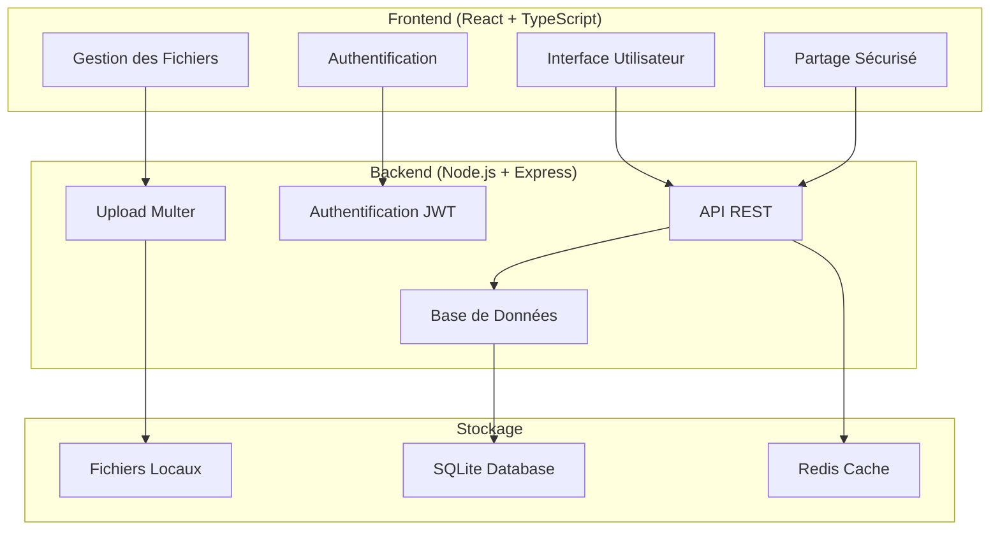

<div align="center">

# 🚀 Emynopass

### Plateforme de partage de fichiers sécurisée entre amis

[](https://opensource.org/licenses/MIT)
[](https://nodejs.org/)
[](https://www.typescriptlang.org/)
[](https://reactjs.org/)
[](https://www.docker.com/)

*Partagez vos fichiers en toute sécurité avec vos amis*

</div>

---

## ✨ Fonctionnalités

### 🔐 Sécurité Avancée
- **Authentification JWT** avec tokens sécurisés
- **Chiffrement des fichiers** avec mots de passe optionnels
- **Limitation des téléchargements** par fichier
- **Expiration automatique** des liens de partage
- **Rate limiting** pour prévenir les abus

### 📁 Gestion des Fichiers
- **Upload drag & drop** avec interface intuitive
- **Prévisualisation** des fichiers avant partage
- **Gestion des types** de fichiers supportés
- **Compression automatique** pour optimiser l'espace
- **Historique complet** des fichiers partagés

### 👥 Interface Utilisateur
- **Design moderne** avec animations fluides
- **Interface responsive** pour tous les appareils
- **Thème sombre/clair** (bientôt disponible)
- **Notifications en temps réel**
- **Gestion des profils** utilisateurs

### 🛠️ Administration
- **Panneau d'administration** complet
- **Gestion des utilisateurs** et permissions
- **Statistiques détaillées** d'utilisation
- **Logs de sécurité** et monitoring
- **Sauvegardes automatiques**

---

## 🏗️ Architecture



---

## 🚀 Installation Rapide

### Prérequis
- **Docker** et Docker Compose (recommandé)
- **Node.js** 18+ et npm (pour développement)
- **Git**

### 🐳 Avec Docker (Recommandé)

#### Démarrage Ultra-Rapide
```bash
# 1. Cloner le projet
git clone https://github.com/Polosk0/emynopass.git
cd emynopass

# 2. Démarrage automatique (Windows)
START-EMYNOPASS.bat

# 2. Démarrage automatique (Linux/macOS)
chmod +x start-emynopass.sh
./start-emynopass.sh
```

#### Démarrage Manuel
```bash
# 1. Cloner le projet
git clone https://github.com/Polosk0/emynopass.git
cd emynopass

# 2. Configuration
cp env.example .env
# Éditer .env avec vos paramètres

# 3. Démarrage automatique
docker-compose up -d

# 4. Accès à l'application
# Frontend: http://localhost:3000
# Backend: http://localhost:3001
```

#### Commandes Docker Utiles
```bash
# Construire les images
npm run docker:build

# Démarrer les services
npm run docker:up

# Voir les logs
npm run docker:logs

# Arrêter les services
npm run docker:down

# Mode production (avec nginx)
npm run docker:prod

# Nettoyer complètement
npm run docker:clean
```

### 📦 Installation Manuelle

```bash
# 1. Cloner et installer les dépendances
git clone https://github.com/Polosk0/emynopass.git
cd emynopass
npm run install:all

# 2. Configuration
cp env.example .env
# Configurer vos variables d'environnement

# 3. Démarrage en développement
npm run dev

# 4. Build pour la production
npm run build
npm start
```

---

## ⚙️ Configuration

### Variables d'environnement principales

```env
# Base de données
DATABASE_PATH=./data/emynopass.db

# JWT
JWT_SECRET=your-super-secret-jwt-key

# Serveur
PORT=3001
FRONTEND_URL=http://localhost:3000

# Stockage
UPLOAD_DIR=./uploads
MAX_FILE_SIZE=100MB

# Redis (optionnel)
REDIS_URL=redis://localhost:6379
```

### 🔧 Scripts Disponibles

```bash
# Développement
npm run dev              # Démarre frontend + backend
npm run dev:backend      # Backend uniquement
npm run dev:frontend     # Frontend uniquement

# Production
npm run build            # Build complet
npm run start            # Démarrage production

# Maintenance
npm run clean            # Nettoyer node_modules
npm run clean:build      # Nettoyer les builds
npm run install:all      # Installer toutes les dépendances

# Docker
npm run docker:up        # Démarrer avec Docker
npm run docker:down      # Arrêter Docker
npm run docker:logs      # Voir les logs
```

---

## 📚 Documentation API

### 🔑 Authentification

```http
POST /api/auth/register
Content-Type: application/json

{
  "email": "user@example.com",
  "username": "username",
  "password": "password123",
  "firstName": "John",
  "lastName": "Doe"
}
```

### 📤 Upload de Fichier

```http
POST /api/files/upload
Authorization: Bearer <token>
Content-Type: multipart/form-data

file: <fichier>
password: <mot de passe optionnel>
maxDownloads: <nombre max de téléchargements>
expiresIn: <expiration en heures>
message: <message optionnel>
```

### 🔗 Partage Sécurisé

```http
POST /api/share/create
Authorization: Bearer <token>
Content-Type: application/json

{
  "fileId": "file-id",
  "password": "optional-password",
  "maxDownloads": 10,
  "expiresIn": 24,
  "message": "Message optionnel"
}
```

📖 **[Documentation API complète](docs/API.md)**

---

## 🛡️ Sécurité

### 🔒 Mesures de Sécurité Implémentées

- **Authentification JWT** avec expiration
- **Chiffrement bcrypt** des mots de passe
- **Rate limiting** par IP et utilisateur
- **Validation stricte** des fichiers uploadés
- **Sanitisation** des entrées utilisateur
- **Headers de sécurité** (Helmet.js)
- **CORS** configuré
- **Logs de sécurité** détaillés

### 🚨 Recommandations Production

1. **HTTPS obligatoire** avec certificats SSL
2. **Mots de passe forts** pour JWT_SECRET
3. **Firewall configuré** (ports 80, 443 uniquement)
4. **Sauvegardes automatiques** quotidiennes
5. **Monitoring** des logs et performances
6. **Mise à jour régulière** des dépendances

---

## 🎨 Interface Utilisateur

### 🖥️ Captures d'Écran

<div align="center">

| **Page d'Accueil** | **Upload de Fichiers** | **Gestion des Partages** |
|:---:|:---:|:---:|
| Interface moderne et intuitive | Drag & drop avec prévisualisation | Contrôle total des partages |

</div>

### 🎯 Fonctionnalités UI

- **Design responsive** adaptatif
- **Animations fluides** avec Framer Motion
- **Thème cohérent** avec Tailwind CSS
- **Icônes modernes** avec Lucide React
- **Notifications toast** pour le feedback
- **Loading states** pour une meilleure UX

---

## 🚀 Déploiement

### 🌐 VPS Ubuntu

```bash
# 1. Se connecter au VPS
ssh user@your-vps-ip

# 2. Installer les prérequis
sudo apt update
sudo apt install nodejs npm git nginx -y

# 3. Cloner et configurer
git clone https://github.com/Polosk0/emynopass.git
cd emynopass
npm run install:all
cp env.example .env

# 4. Build et démarrage
npm run build
pm2 start ecosystem.config.js

# 5. Configuration Nginx
sudo nano /etc/nginx/sites-available/emynopass
sudo ln -s /etc/nginx/sites-available/emynopass /etc/nginx/sites-enabled/
sudo nginx -t && sudo systemctl restart nginx
```

### 🐳 Docker Production

```bash
# Configuration production
cp env.example .env
# Configurer .env pour la production

# Déploiement
docker-compose --profile production up -d

# Monitoring
docker-compose logs -f
```

---

## 📊 Monitoring et Maintenance

### 📈 Scripts de Maintenance

```bash
# Sauvegarde automatique
./scripts/backup.sh

# Nettoyage des fichiers temporaires
./scripts/cleanup.sh

# Mise à jour de l'application
./scripts/update.sh

# Vérification de santé
./scripts/health-check.js
```

### 📋 Logs et Debugging

```bash
# Logs en temps réel
docker-compose logs -f

# Logs spécifiques
docker-compose logs backend
docker-compose logs frontend

# Debug mode
npm run dev:debug
```

---

## 🤝 Contribution

Nous accueillons les contributions ! Voici comment participer :

### 🔧 Développement

```bash
# 1. Fork le projet
# 2. Cloner votre fork
git clone https://github.com/votre-username/emynopass.git

# 3. Créer une branche feature
git checkout -b feature/amazing-feature

# 4. Installer et tester
npm run install:all
npm run dev

# 5. Commit et push
git commit -m "Add amazing feature"
git push origin feature/amazing-feature

# 6. Créer une Pull Request
```

### 📝 Guidelines

- **Code propre** et commenté
- **Tests** pour les nouvelles fonctionnalités
- **Documentation** mise à jour
- **Respect** des conventions de nommage
- **Messages de commit** clairs et descriptifs

---

## 📄 Licence

Ce projet est sous licence **MIT**. Voir le fichier [LICENSE](LICENSE) pour plus de détails.

---

## 🆘 Support

### 📞 Aide et Support

- **Documentation** : [docs/](docs/)
- **Issues GitHub** : [Créer une issue](https://github.com/Polosk0/emynopass/issues)
- **Discussions** : [GitHub Discussions](https://github.com/Polosk0/emynopass/discussions)

### 🐛 Signaler un Bug

1. Vérifiez que le bug n'existe pas déjà
2. Créez une issue avec :
   - Description détaillée
   - Étapes de reproduction
   - Environnement (OS, Node.js, etc.)
   - Logs d'erreur si disponibles

### 💡 Proposer une Fonctionnalité

1. Vérifiez les issues existantes
2. Créez une issue avec le label "enhancement"
3. Décrivez clairement la fonctionnalité
4. Expliquez pourquoi elle serait utile

---

## 🙏 Remerciements

- **React** - Framework UI
- **Node.js** - Runtime backend
- **Express** - Framework web
- **TypeScript** - Typage statique
- **Tailwind CSS** - Framework CSS
- **Framer Motion** - Animations
- **Lucide React** - Icônes
- **SQLite** - Base de données
- **Redis** - Cache
- **Docker** - Containerisation

---

<div align="center">

### ⭐ Si ce projet vous plaît, n'hésitez pas à lui donner une étoile !

**Fait avec ❤️ par l'équipe Emynopass**

[](https://github.com/Polosk0/emynopass/stargazers)
[](https://github.com/Polosk0/emynopass/network)

</div>
